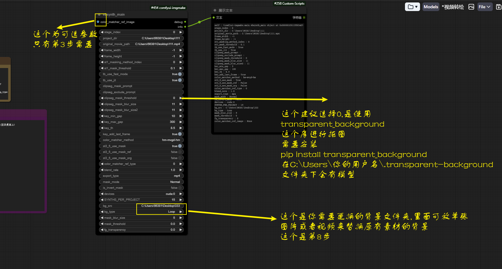
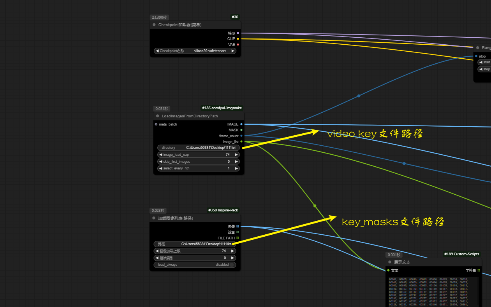
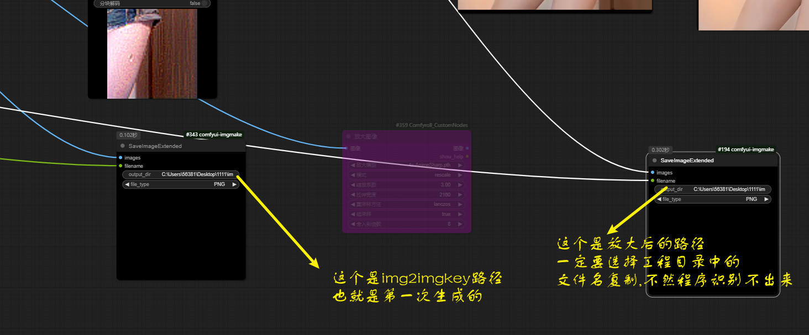

借鉴的https://github.com/s9roll7/ebsynth_utility这个项目.我只是把该节点部分功能集成到了comfyui中,再加上自己写的一些功能节点

安装方法:

首先要给你的电脑配置ffmpeg环境变量 https://ffmpeg.org/

另外安装https://ebsynth.com/

安装方式 pip install -r requirements.txt

单独安装一下 pip install transparent-background

安装完成后请检查C:\Users\你的用户名\.transparent-background此文件路径下应该有几个模型文件

如果不能自动下载,请开启科学上网或者手动下载到该路径下

b站视频教程地址【comfyui-imgmake详细安装使用教程】https://www.bilibili.com/video/BV1WVS3YqELA?vd_source=17fa10fe811dc6d31dd5904ec33d340d